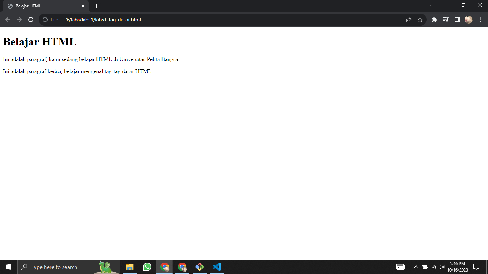

# Pertemuan Ke 4

## Profil
| Variable | Isi |
| -------- | --- |
| **Nama** | Intan Virginia Aulia Putri |
| **NIM** | 312310657 |
| **Kelas** | TI.23.A.6 |
| **Mata Kuliah** | Bahasa Pemrograman |

#### Latihan
- Buatlah satu repository LatihanVCS.
- Buat file README.md, lalu isi file tersebut dengan
penjelasan (tutorial) cara penggunaan git, dan
langkah-langkahnya lengkapi juga dengan screenshot
prosesnya.

### Langkah-langkah membuat repository di GitHub
- Buka GitHub: Akses situs web GitHub di https://github.com/ dan login ke akun GitHub. Jika belum memiliki akun, perlu membuat terlebih dahulu.
- Buat Repository Baru: Setelah masuk, klik pada tanda "+" di bagian atas kanan layar, dan pilih opsi "New repository".
- Isi Informasi Repository: Isikan nama repository pada kolom "Repository name" menjadi "LatihanVSC". Pilih opsi untuk membuat repository menjadi public. Pilih opsi untuk membuat repository dengan file README.
- Buat Repository: Setelah mengisi semua informasi, klik tombol "Create repository" di bagian bawah halaman.
- Klon Repository ke Komputer: Gunakan URL repository yang disediakan di halaman repository dan jalankan perintah ke Git Bash: `git clone https://github.com/username/nama-repository.git`
- Masuk ke Direktori Repository:Pindah ke direktori repository yang baru saja Anda klon dengan menggunakan perintah `cd`: `cd nama-repository`
- Buat Commit: Buat commit untuk menyimpan perubahan yang telah dibuat: `git add` `git commit -m "Menambahkan Screenshot"`
- Push ke Repository di GitHub: `git push -u origin main`

### Cara membuat html di VSC
- Download dan Install Visual Studio Code
- Buka Visual Studio Code
- Pilih menu File di bagian kiri atas, lalu klik opsi New File
- Untuk menyimpan file sebagai HTML, pilih menu File lagi dan klik Save As
- Pilih lokasi untuk menyimpan file, lalu masukkan nama file dengan ekstensi .html. Contoh `labs1_tag_dasar.html`
- Klik Save
- Menulis kode HTML di Visual Studio Code
  
``` html
<!DOCTYPE html>
<html>
    <head>
        <title>Belajar HTML</title>
    </head>
    <body>
        <h1>Belajar HTML</h1>
        <p>Ini adalah paragraf, kami sedang belajar HTML di Universitas Pelita Bangsa</p>
        <p>Ini adalah paragraf kedua, belajar mengenal tag-tag dasar HTML</p>
    </body>
</html>
```

### Penjelasan
- `<!DOCTYPE html>`: Ini adalah deklarasi tipe dokumen (Document Type Declaration) dan memberi tahu browser bahwa halaman web ini menggunakan versi HTML yang terbaru
- `<html>`: Ini adalah elemen root dari halaman HTML, dan semua elemen HTML harus berada di dalamnya
- `<head>`: Ini adalah bagian kepala dari halaman HTML dan biasanya digunakan untuk menempatkan elemen-elemen meta-informasi seperti judul halaman, link ke stylesheet, dan lainnya.
- `<title>`: Ini adalah elemen yang berada di dalam <head> dan digunakan untuk menetapkan judul halaman yang akan muncul di tab browser.
- `<body>`: Ini adalah bagian tubuh dari halaman HTML dan berisi konten utama yang akan ditampilkan di browser.
- `<h1>`: Ini adalah elemen heading level 1, digunakan untuk judul utama halaman. Semakin tinggi nomor heading, semakin kecil ukurannya.
- `<p>`: Ini adalah elemen paragraf, digunakan untuk menampilkan teks paragraf.

#### Tampilan output

